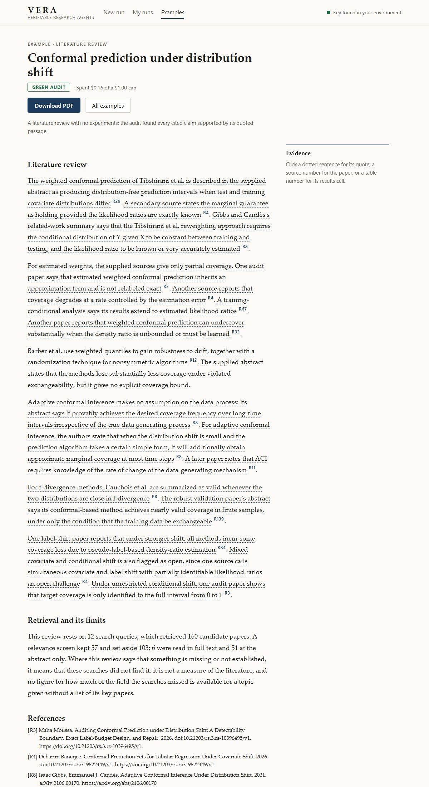
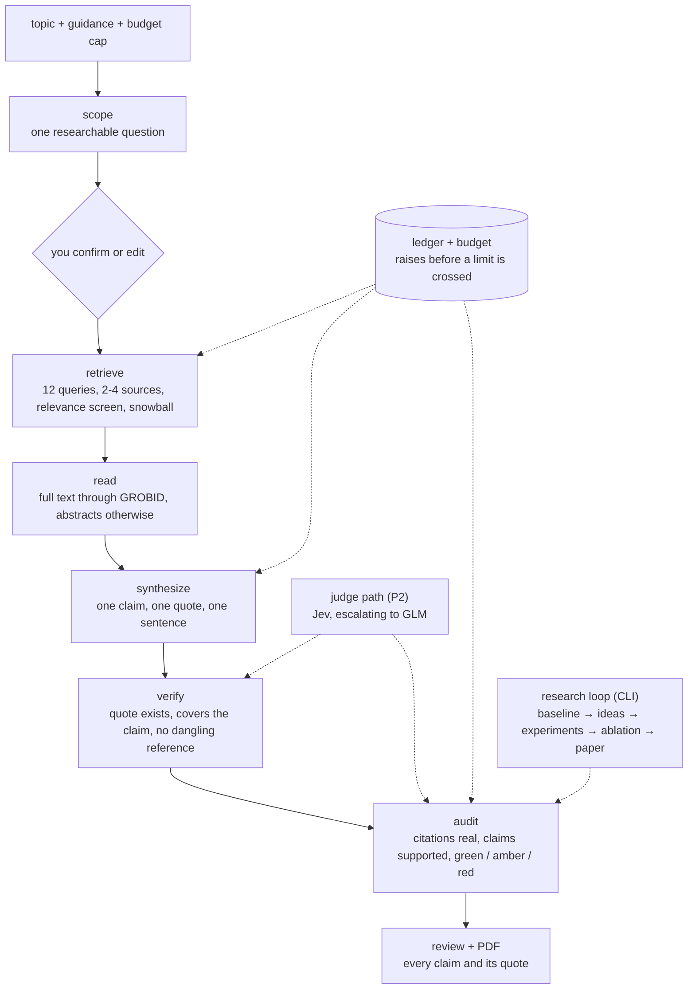

# VERA — literature reviews and research runs you can check, on your own key

**Status: Increments 0 to 5 complete (2026-10-09), portfolio project.**
**▶ Read-only showcase: [pcschmidt.github.io/VERA](https://pcschmidt.github.io/VERA/)**: seven finished examples with
their evidence panel, the exact inputs behind each, and a PDF of each. The app itself runs on your own machine with your
own model key (see [Quickstart](#quickstart)); a static page cannot run a pipeline, and nothing on that page runs a model
or asks for a key. Build history and every known gap: [docs/reviews/incr-5.md](docs/reviews/incr-5.md).

<div align="center">



</div>

*The reader. Every cited sentence in the review is dotted; clicking one opens the exact quote it rests on and where
in the source it sits, clicking a source number opens the paper, and the audit result is stated in plain words under the
text. The same review downloads as a PDF with every claim and its quote in an appendix.*

## What is this? (plain-language overview)

VERA (Verifiable, Economical Research Agents) answers one question: *can an AI research assistant be made cheap enough to
use, and checkable enough to trust?* Autonomous research agents now write papers that clear automated review bars. Two gaps
follow: almost nobody can afford to run them, and nobody independent checks whether what they write is true. VERA
addresses both with three layers: a cheap-by-default **judge** (P2), an **auditor** that checks a paper's citations, numbers
and claims (P1), and a **research agent** (P3) that takes a topic and produces a paper-shaped write-up under a hard budget.

> Topic → one confirmed question → search → read → write with quotes → **audit, and say what the audit cannot show.**

You give it a topic. It proposes **one** research question and waits for you to confirm or edit it. It then searches
several paper databases, reads the most relevant papers (in full text where it can), writes a review in which every claim is
tied to an exact quote from a source, and audits the result. For topics where a published method has public code, a second
mode reproduces the parent's baseline in a sandbox, tries new ideas against it and writes a paper with figures; that mode runs
from the command line today, not from the app.

The thing that makes it more than a summarizer:

- **Every claim has a quote, and a claim without one is removed.** A claim is one assertion with one quote that covers it;
  deterministic checks reject a sentence that joins two assertions or leans on an earlier one, and a judge that sees only the
  quote must agree it states the claim. The audit then checks each citation exists and each claim is supported by the passage
  it quotes. **A green audit is not a correct review**: the independent scorer found an overstated claim and an unsupported
  sentence in reviews that passed it (see [Results](#results)).
- **Your key, your money, bounded.** The app uses the model key you connect and charges every call to your account. You set a
  cap on every run and it stops before passing it, keeping what it had done. The key is held in memory, passed to the worker
  through its environment and written nowhere; an adversarial test has the provider echo the key back in an error and checks it
  appears in no file, status or message.
- **Measured against the thing it imitates, and the results are reported as they came.** Compared with ScientistTwo (86
  generated papers, about $3,800 and 2 to 3 days per task as its site states), VERA's loop ran at about ten cents of model
  spend per run and **did not improve either parent's baseline**; the comparison's gain half is not met and the cost half is
  not assessable (ScientistTwo publishes no per-run cost).
- **Nothing grades itself.** Every judgement comes from a component other than the one that produced the material; every
  call goes through a ledger and a budget that raises before a limit is crossed; every audit, test set and target is written
  down and hashed before the run it will judge.

You can drive it three ways:

1. **The showcase**: read seven finished examples, each with its question, guidance, cost, audit result and, where we found
   problems after the audit passed, a "Known issues" box.
2. **The local app**: `uv run vera-app`, then a browser. Connect a key, state a topic, confirm the question, watch the stages
   and spend, stop and resume, read the review with its evidence, download a PDF.
3. **The command line**: the research loop (`scripts/run_loop.py`), the literature stage (`scripts/run_topic.py`), the audit
   and every measurement behind the numbers below.

| | |
| --- | --- |
| Showcase | https://pcschmidt.github.io/VERA/ (static, built from committed files by `scripts/build_pages.py`, deployed by GitHub Actions) |
| App | FastAPI on `127.0.0.1` only, plain HTML and JavaScript, no build step; `uv run vera-app` |
| Literature stage | scope → confirm → queries → retrieve → screen → snowball → read (GROBID) → synthesize with quotes → verify → audit |
| Sources | arXiv and Crossref keyless; OpenAlex and Semantic Scholar with your own keys |
| Models | Claude Sonnet 5.5 writes (via OpenRouter); GLM-5.3 Flash judges (Jev, a typed-decision model, answers first when a key is set) |
| Cost | $0.11 to $0.21 of model fees per literature review in this project's runs; the cap you set is the limit |
| Wall time | 7.5 to 15 minutes per review in this project's runs |
| Tests | 689 passing (`uv run pytest -q`, about 2.5 minutes), including offline fakes for every model call |
| Audit | Frozen-source test of 52 planted faults: 50 caught; **3 of 6 clean controls failed** (two for a real misstatement, one unexamined) |
| Quality (blind human scores) | 3 to 5 on five criteria for three app reviews; the independent scorer gave the same reviews 2 to 4; coverage is its lowest criterion and tied lowest on the builder's |
| Licence | MIT (code and docs); the ScientistTwo corpus and other third-party material are never committed |
| Honest scope | A research prototype built by one person. **MOE-4 (a new user completes a run) is not shown**: the one walkthrough was the builder. Experiments are not started from the app |

## Architecture at a glance



The app is a thin layer over the same pipeline: a run is a worker process started with the key in its environment; the live
view reads the run's own ledger, gate and audit files, and computes nothing a run did not record. Stop is a file the next
model call notices; resume restarts from the last checkpoint without repeating paid work.

## Quickstart

### 0. Just look (nothing to install)

Open [pcschmidt.github.io/VERA](https://pcschmidt.github.io/VERA/) and read an example: click a dotted sentence for its quote, a
source number for the paper, press **Download PDF**.

### 1. Run the app (Python 3.11+ and [uv](https://docs.astral.sh/uv/))

```bash
git clone https://github.com/PCSchmidt/VERA.git
cd VERA
uv sync
uv run vera-app
```

The first start can take up to half a minute. Open http://127.0.0.1:8765, press **Connect my key**, paste an OpenRouter key
(your OpenRouter account, under Keys, with a small credit) and start a run. If your topic uses acronyms or new terms, define
them in the topic box: the proposal is only as good as the topic you give it.

Optional: Docker with the GROBID image running on port 8070
(`docker run --rm -p 8070:8070 lfoppiano/grobid:0.8.2`; on WSL2 add `-e JAVA_TOOL_OPTIONS=-XX:-UseContainerSupport`) lets VERA
read full texts; without it, it reads abstracts and says so. A `SEMANTIC_SCHOLAR_API_KEY` or `OPENALEX_API_KEY` in a `.env`
file widens the paper search. If another project's virtual environment is active, `uv` prints a harmless warning that it will
be ignored.

### 2. Run the tests

```bash
uv sync --group dev --group bench --group corpus
uv run pytest -q          # 689 tests, offline, no keys needed
uv run ruff check .
```

### 3. The research loop and the measurements (command line)

The loop needs Docker for its sandbox and the parent problems' data; each script's docstring says what it needs and what it
costs. For example `scripts/run_loop.py` (the loop on TreeHFD or the credal problem), `scripts/run_topic.py` (the literature
stage), `scripts/run_seeded_v3.py` (the audit's planted-fault test), `scripts/retest5.py` (the judge on 150 gate decisions).

## Approach: why it is built this way

- **Gates, not hope.** Work is built in increments, each ending in a review that an independent Evaluator (a fresh model that
  did not write it) must pass, and human approvals that only the owner gives. The harness is
  [Meridian](docs/meridian-dogfood.md); findings about it from building VERA are written up there.
- **No self-grading.** A component never issues the verdict on its own artifact. The audit's judge is never the producer of
  the text it judges; the independent rubric scorer ran after the human's scores and was instructed not to open them.
- **Frozen before tested.** The audit's source is hashed before its one test run; a later change to a frozen file spends that
  test set. (This rule was broken once, in Increment 4, and the review says so; this increment changed no frozen file.)
- **Cheap by default, measured.** The judge library splits decisions into small questions, answers with a cheap model first
  and escalates when it is unsure: about 1 to 2% of the reference judge's cost at matching decisions in the Increment 1
  benchmark (6,095 verdicts for $1.61).
- **Honest by construction.** Seeded faults, gold sets and controls test the auditor; blind human scores test the output; each
  review lists what fell short.

## Method (what the pipeline actually does)

1. **Scope.** The topic becomes one researchable question with a stated reason it is researchable; a check rejects a question
   that is not specific enough, and you can edit what it proposes before anything more is spent.
2. **Retrieve.** Twelve queries over seven angles go to arXiv and Crossref (and OpenAlex and Semantic Scholar with keys). Records
   are merged, a judge screens them for relevance, and the kept papers' reference lists seed a snowball step.
3. **Read.** The top papers are read in full text through GROBID; the rest at the abstract only, and the reading report says
   which.
4. **Synthesize and verify.** The writer drafts sentences that each carry one claim and one quote. Deterministic checks (the quote
   exists in the source, the source key exists, no editorial connective the quote lacks, no sentence leaning on an earlier one) run
   first, then a judge shown only the quote; failures go to one repair pass that lists what it drops. A sentence that names a
   source in running text with no claim behind it is removed.
5. **Audit.** Citations are checked to exist and each claim to be supported by its passage; the result is green, amber or red
   with its findings, and the review states its own retrieval statistics (queries, candidates, kept, read in full, dropped).
6. **Write-up and PDF.** The reader links each claim to its quote and each source to its paper; the PDF carries the text,
   tables, figures, the audit and an appendix of every claim with its quote.

The experiment mode (command line) reproduces a parent paper's baseline in a Docker sandbox against a registered target, has the
model propose and implement ideas, screens and runs them on subsets, runs a registered protocol when the question describes
one, and writes a paper with figures drawn from `results.json`; the audit checks every table cell and figure datum against it.

## Results

Full tables with run ids and caveats are in the reviews: [`docs/reviews/`](docs/reviews/) (one per increment) and
[`docs/results/`](docs/results/). The headline results, each from a file in the repository:

| Question | Result |
| --- | --- |
| Can the judge be cheap? | Jev escalating to GLM-5.3 Flash agrees with the reference judge at about 1 to 2% of its cost on the Increment 1 benchmark; on 150 of the loop's gate decisions it agreed on all 150 (97.5 to 100%), **but only 14 are real new decisions and 136 are perturbed copies**, so this shows it is not near-tie fragile, not that it is accurate on hard cases |
| Does the audit catch planted faults? | 50 of 52 on a frozen-source test (96%, 87 to 99%); known misses: `reversed_comparison` 3 of 4, `overstated_claim` 1 of 2. **3 of 6 unmodified controls failed**, two of them because the papers really misstated the reproduction basis |
| Is a green audit enough? | **No.** The independent scorer found, in app reviews that were green: a claim that says "sampling" where its quote does not, an uncited generalisation, and an unsupported sentence naming a source missing from the references (that last kind is now removed automatically) |
| Does retrieval find the key papers? | Pooled over six topics, 34 of 58 key papers retrieved before the relevance screen (59%); adding Semantic Scholar with the same queries: 37 of 58 (64%). Retrieval remains the weakest stage |
| Did the research loop beat a baseline? | **No**, on either parent problem. TreeHFD: the one idea run was worse on every dataset. Credal ambiguity sets: both ideas far worse than the parent's method (MAE 24.6 and 47.4 against 10.7), with spreads near zero that point at an undiagnosed fault |
| Did the protocol answer its question? | Partly. Of four expectations written before the run, three failed (e.g. TreeHFD's percentage error fell, not rose, with correlation) and one held; TreeHFD's component error was below TreeSHAP's at every correlation above zero |
| Versus ScientistTwo (MOE-3) | Not met: the gain half fails on TreeHFD, the two did not attempt the same problem on the credal one, and ScientistTwo's per-run cost is not published |
| What does a review cost and take? | $0.11 to $0.21 and 7.5 to 15 minutes in this project's runs; install on a clean clone is `git clone` 2 s, `uv sync` 8 s |
| Is the output good? | Blind human scores (the builder's) 4.27 on average over three app reviews, the independent scorer's 2.93; only 2 of 15 cells agree and the builder is at or above the independent scorer in every cell. Coverage is the independent scorer's lowest criterion and tied lowest on the builder's. No evidence that quality improved since Increment 4 |
| Can a new user use it? | **Not shown.** One walkthrough, by the builder from a clean clone: a finished run in 10.8 minutes for $0.141; his verdict was that the first interface was not attractive or friendly (a redesign followed the same day) and that one run could not say whether he would keep using it |

## Limitations

- **No independent user yet.** MOE-4 is not shown; the walkthrough was the builder. The redesign and the PDF export have been seen
  by no one else.
- **A green audit is a floor.** It checks that citations exist and that each cited claim is supported by its quote. It does not check
  that the review is complete, that conclusions follow, or that a sentence without a citation is true (one such defect class is now
  caught; others may remain).
- **Retrieval misses papers** (about a third of the key papers on measured topics, before the screen), and a review is limited by
  what the search found. It says so in a paragraph of its own.
- **Reviews lean on abstracts.** In the runs here, most papers were read at the abstract only; full-text reading needs GROBID.
- **No conclusions section.** The reviews say what the literature does and does not establish; they do not offer conclusions of
  their own, because unmarked conclusions would break the one-claim-one-quote promise. A clearly labelled synthesis section is an open decision.
- **Experiments are not in the app.** The loop runs from the command line on two parent problems and has not beaten a baseline.
- **Same-family grading.** The writer is a Claude model and so is the independent scorer; the cheap judge is a different family.
- **The audit's freeze was broken in Increment 4** (a frozen file changed after its test runs) and its checks block at HEAD by
  design; this increment changed none of the frozen files.
- **One builder, one machine.** The app and the tests were exercised on Windows with Python 3.11; the showcase build also runs on Linux in CI; no other operating system was exercised.

## Operational notes

### What runs where

| Piece | Where |
| --- | --- |
| The app and the research pipeline | Your machine (Python, `uv`) |
| The model calls | OpenRouter, charged to your key |
| Paper search | arXiv, Crossref, and OpenAlex or Semantic Scholar if you supply keys |
| Full-text reading | GROBID in Docker on your machine (optional) |
| The experiment sandbox | Docker on your machine (command line only) |
| The showcase | GitHub Pages, static files only |

### Data and keys

No maintainer key is in the repository, any build artifact or any log; `tests/test_no_secrets.py` and `tools/checks/check_app.py`
scan for key-shaped strings. The app never falls back to a key that is not yours. Keys you place in a `.env` file (git-ignored)
are read from your environment. The ScientistTwo corpus is evaluation data: its PDFs are stored locally and never committed
(`data/raw/` is git-ignored; see [`data/README.md`](data/README.md)).

### Verify the claims (a reviewer's path)

```bash
uv run pytest -q                                          # 689 passed (record: docs/results/incr5_test_run.txt)
python tools/checks/check_app.py --part secrets           # no key-shaped string, local-only server, no external loads
python tools/checks/check_carry5.py                       # frozen audit files unchanged since Increment 5 was scoped
python tools/checks/check_rubric5.py                      # human scores blind and earlier than the independent scorer's
bash scripts/gate-engine.sh current                       # where the build stands, gate by gate
uv run python scripts/build_pages.py --out _site          # rebuild the showcase from committed files
```

Then open any example on the showcase and click a dotted sentence: the quote and its place in the source are the evidence.
Each increment's review ends with the independent Evaluator's verdicts, kept unedited in `.meridian/evaluator/`.

### Documentation map

| Doc | What it covers |
| --- | --- |
| [docs/01-conops.md](docs/01-conops.md) | users, scenarios and measures of effectiveness (MOE-1 to MOE-4) |
| [docs/02-requirements.md](docs/02-requirements.md) | requirements with their verification methods |
| [docs/03-interfaces.md](docs/03-interfaces.md) | the data contracts (schemas v0.11) |
| [docs/04-trade-studies.md](docs/04-trade-studies.md) | design decisions T1 to T10, each with scores, a decision and a reverse-if |
| [docs/05-risk-register.md](docs/05-risk-register.md), [docs/06-verification-plan.md](docs/06-verification-plan.md) | risks, and the V&V strategy including seeded-fault testing |
| [docs/07-increments.md](docs/07-increments.md) | the increment plan with exit criteria |
| [docs/reviews/](docs/reviews/) | the review of each increment, with the Evaluator's rounds |
| [docs/results/](docs/results/) | measured results: audit tests, retrieval recall, protocol runs, the ScientistTwo comparison, the app's first live run |
| [docs/walkthrough/](docs/walkthrough/) | the participant and observer guides for the new-user walkthrough |
| [docs/meridian-dogfood.md](docs/meridian-dogfood.md) | what building VERA showed about its build harness |
| [CLAUDE.md](CLAUDE.md), [SPEC.md](SPEC.md), [CONTRACT.md](CONTRACT.md) | working instructions, the current increment's spec, its scope contract |

## Glossary

| Term | Stands for | What it means here |
| --- | --- | --- |
| VERA | Verifiable, Economical Research Agents | This project |
| P1 / P2 / P3 | — | The auditor, the judge library and the research agent |
| MOE | Measure of Effectiveness | A project-level success measure in the concept of operations (MOE-4: a new user completes a run) |
| BYOK | Bring your own key | The app uses the user's model key and money, never the maintainer's |
| Ledger | — | The append-only record of every model call and its cost for a run |
| Audit (green / amber / red) | — | Whether citations exist and each claim is supported by its quote; red means a check failed, amber means warnings |
| Seeded fault | — | A defect planted in a document to measure whether the auditor catches it |
| Control | — | An unmodified document the auditor should pass |
| Frozen audit | — | The audit's source hashed before its one test run, so the test measures the audit shipped |
| ScientistTwo | — | A system that generates research papers; the comparison target for the research loop |
| TreeHFD, TreeSHAP | Tree Hoeffding decomposition, tree Shapley values | Two ways of explaining a tree ensemble's predictions, used as the loop's first parent problem |
| Credal ambiguity set | — | A set of probability distributions a decision must be robust to; the loop's second parent problem |
| GROBID | GeneRation Of BIbliographic Data | The open-source tool that reads a paper's PDF into text and references |
| OpenRouter | — | The service that routes model calls with a single key |
| Jev | — | A typed-decision model used as the cheap first judge when a key is set |
| GLM-5.3 Flash | — | The cheap model that judges when Jev is unsure or absent |
| Sonnet 5.5 | Claude Sonnet 5.5 | The model that writes the reviews and papers |
| Meridian | — | The gated build harness the project is developed with |
| Evaluator | — | A fresh model that did not write the work, scoring each increment's review before it can pass |
| uv | — | The Python package and environment tool used to install and run the project |
| PDF | Portable Document Format | The downloadable form of a review, with every claim and its quote in an appendix |

## Licence

MIT (see [LICENSE](LICENSE)) for VERA's code and docs. It does not cover the ScientistTwo papers or any other third-party material
VERA evaluates; those are never committed. The bundled PDF font family (DejaVu, `vera/app/fonts/`) keeps its own licence beside it.

## Author

Chris Schmidt, built with Claude Code under the Meridian harness. Ideas and decisions are his; the agent builds, runs and reports,
and every human gate is approved by him alone.
