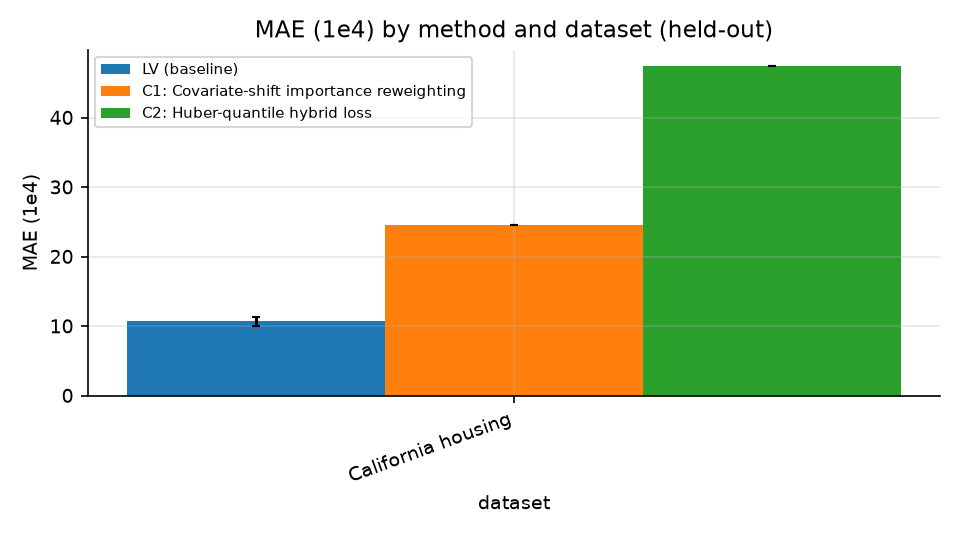

## Abstract

We tried to improve LV, a bulk-calibrated credal-ambiguity-set method for robust linear regression, on California Housing under an East-to-West geographic shift. The baseline reproduced the parent paper's Table 3 LV row within the registered 5% tolerance, and LV was the best of the five methods. A language model generated three ideas, and two were run on the subset: covariate-shift importance reweighting (C1) and a Huber-quantile hybrid loss (C2). Neither beat LV on MAE. Both were much worse. This is a negative result from a crude loop and should be read that way.

## Related work

The review found no study that compares credal sets (imprecise Dirichlet or epsilon-contamination neighborhoods) with Wasserstein and mean-covariance sets in small, contaminated samples under a common tuning rule. The Wasserstein literature offers some relevant evidence. Mohajerin Esfahani and Kuhn state that the optimal value of the Wasserstein distributionally robust problem gives an upper confidence bound on the achievable out-of-sample cost, and in their portfolio experiments the reliability of the certificate did not decrease as the radius grew [R4]. Gao reports that the radius rule in the original guarantee suffers from the curse of dimensionality, and notes that radius selection is often done by cross validation in practice [R5]. One comparison of Wasserstein and moment-based chance-constrained models used much larger training samples and a chance-constrained problem. Both models exceeded the target reliability, and the Wasserstein model was significantly closer to the target [R8]. Contamination is addressed only within Wasserstein-type frameworks. Outlier-robust Wasserstein DRO adds total-variation contamination that lets a fraction of the data be arbitrarily corrupted [R22]. That is not a comparison against credal or moment sets under matched tuning. The relative performance of the three families in small, contaminated samples is not established by these passages. The review reflects what the searches found, not the whole literature.

## Method

Data: California Housing, trained on the Eastern 50% and tested on the Western 20%, with a 30% gap between them. We used 100 replications. Errors are in units of 1e4 dollars, and lower is better. The parent's solver MOSEK was replaced by the open solver Clarabel.

Baseline check: the LV row was reproduced against the parent's Table 3 within the 5% tolerance, with LV best of the five methods (gate verdict True). The facts supplied do not say whether this reproduction used held-out or in-sample rows for California Housing, so I do not state it. Only one dataset was run, so no trend across datasets or correlation values can be reported for the baseline.

Ideas: three were generated and two were run on the subset.
- **C1, covariate-shift importance reweighting.** A logistic classifier (sklearn) separates eastern training rows from western unlabeled test covariates. Its predicted odds serve as density-ratio weights, clipped to a robust cap, in the absolute-loss fit.
- **C2, Huber-quantile hybrid loss.** The absolute loss is replaced by a Huberized quantile loss at tau=0.5. It is quadratic for small residuals and linear beyond a cross-validated threshold, and is solved by scipy least_squares or IRLS.

## Results

Results from a research-loop run on the LV problem (mean ± std over 100 seeds). ↓ = lower is better; ↑ = higher is better.

| Method | California housing · MAE (1e4) ↓ | California housing · RMSE (1e4) ↓ | California housing · p98 absolute error (1e4) ↓ | California housing · CVaR 2% absolute error (1e4) ↓ | California housing · Runtime (s) ↓ |
|---|---|---|---|---|---|
| LV (baseline) | 10.7 ± 0.70 | 12.2 ± 0.75 | 21.9 ± 1.2 | 23.9 ± 1.1 | 1.66 ± 0.055 |
| C1: Covariate-shift importance reweighting | 24.6 ± 0.00000000000013 | 25.8 ± 0.00000000000012 | 40.9 ± 0.00000000000016 | 43.7 ± 0.00000000000016 | 2.82 ± 0.069 |
| C2: Huber-quantile hybrid loss | 47.4 ± 0.0000047 | 48.5 ± 0.0000047 | 76.8 ± 0.0000069 | 80.3 ± 0.0000080 | 2.07 ± 0.29 |

Figure 1. MAE (1e4) by method and dataset (held-out).

As Figure 1 and the table show, LV had an MAE of 10.7 ± 0.70, while C1 had 24.6 and C2 had 47.4, so both were far worse. The same ordering holds for RMSE, p98 absolute error and CVaR 2% absolute error. LV was also the fastest (1.66 s against 2.82 s for C1 and 2.07 s for C2).

The standard deviations of C1 and C2 are essentially zero, on the order of 1e-13 to 1e-5. Their results barely varied across the 100 replications. I did not investigate why. It may mean the fit is deterministic given the data, or that something degenerate happened in the implementation. I cannot tell which from these facts, and the poor scores could reflect an implementation problem as much as a weakness in the ideas.

No idea beat the baseline on the primary metric on any registered dataset, so no ablation was run.

## Limitations

- Only one dataset and one East-to-West split were used. The 100 replications are the only source of variation.
- The solver was substituted (Clarabel for MOSEK).
- The ideas were produced and implemented by a language model, with no tuning or debugging beyond what the loop did. The near-zero spreads suggest the implementations may be flawed, so the results do not show that the underlying ideas are bad.
- Only two of three ideas were run, and on a subset.
- The facts do not say which row set (held-out or in-sample) the baseline was reproduced on.

Relation to the research question: that question concerns credal, Wasserstein and mean-covariance ambiguity sets under a common tuning rule, with sample sizes of roughly 10 to 200 and contamination from 0 to 20%. These experiments do not address it. They compare no Wasserstein or moment-based sets. They vary neither sample size nor contamination fraction. They measure out-of-sample error (MAE, RMSE, tail errors) on a regression task under geographic shift, not the reliability of a cost guarantee. They establish only that, on this dataset and split, two alternative fitting ideas did not improve on LV's MAE.

## References

[R4] Peyman Mohajerin Esfahani, Daniel Kühn. Data-Driven Distributionally Robust Optimization Using the Wasserstein Metric: Performance Guarantees and Tractable Reformulations. 2015. arXiv:1505.05116. https://arxiv.org/abs/1505.05116
[R5] Gao, Rui. Finite-Sample Guarantees for Wasserstein Distributionally Robust Optimization: Breaking the Curse of Dimensionality. 2020. arXiv:2009.04382. https://arxiv.org/abs/2009.04382
[R8] Haoming Shen, Ruiwei Jiang. Convex Chance-Constrained Programs with Wasserstein Ambiguity. 2021. arXiv:2111.02486. https://arxiv.org/abs/2111.02486
[R22] Sloan Nietert, Ziv Goldfeld, Soroosh Shafieezadeh-Abadeh. Outlier-Robust Wasserstein DRO. 2023. arXiv:2311.05573. https://arxiv.org/abs/2311.05573
[R161] Clément Bénard. Tree Ensemble Explainability through the Hoeffding Functional Decomposition and TreeHFD Algorithm. 2025. arXiv:2510.24815. https://arxiv.org/abs/2510.24815
[R162] Tianqi Chen, Carlos Guestrin. XGBoost: A Scalable Tree Boosting System. 2016. arXiv:1603.02754. https://arxiv.org/abs/1603.02754
