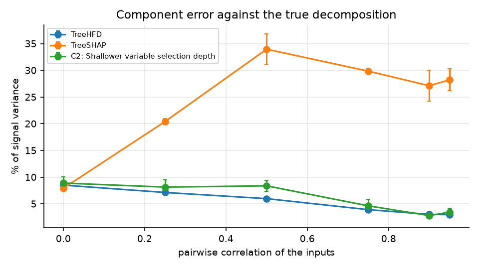
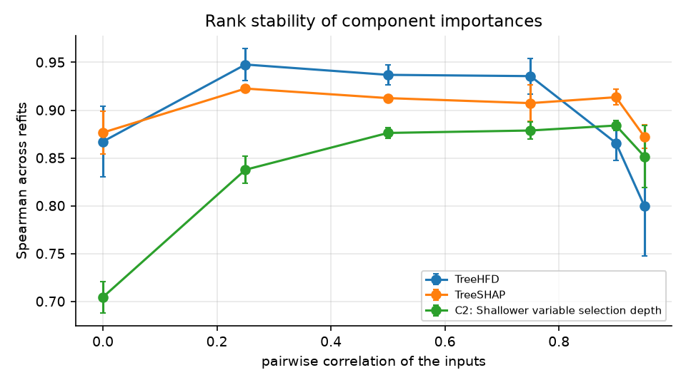
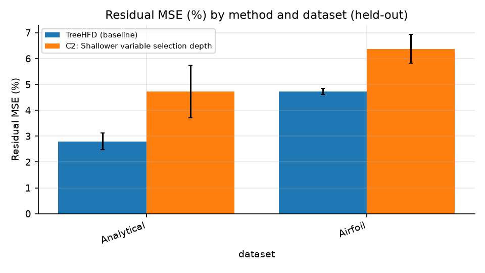

## Abstract

We tried to improve TreeHFD, a method that decomposes an xgboost model into main effects and second-order interactions. A registered protocol was run, and the baseline was reproduced within the registered tolerance. Three ideas were generated and one was run: C2, a shallower variable selection depth. It did not beat the baseline on the primary metric (held-out residual MSE, %) on either dataset. This is a negative result, and no ablation was run. We also compared TreeHFD with xgboost's TreeSHAP across correlation levels on an analytical function with a known decomposition. TreeHFD's own residual MSE and component error both fall as correlation rises. The experiments are small: two datasets, 3 seeds, one model configuration.

## Related work

The TreeHFD paper states that the Hoeffding decomposition breaks black-box models into a unique sum of lower-dimensional functions, provided the inputs are independent, and that for dependent inputs the decomposition is generalized through hierarchical orthogonality constraints [R32]. Its authors report good performance in experiments on simulated and real data, and an empirical finding of a strong connection with TreeSHAP [R32]. A Fourier-analysis paper observes a similar alignment between SHAP attributions and its HFD-like decomposition on several real datasets with substantial feature dependence [R5].

Other work bears on why correlation might matter. Random forest variable importance is reported to be biased toward correlated predictors [R11]. Shapley values are said to suffer from unrealistic data instances when features are correlated, so explanations may mislead [R19]. For dependent measures, correlation structure can alter the composition of component functions and produce distinct rankings [R35]. Path-dependent TreeSHAP can give different feature rankings for two trees computing the same function [R88]. Synthetic datasets that allow ground-truth Shapley values exist for benchmarking attribution methods [R59].

The review found no source reporting component-level error against known components as correlation rises, or bootstrap-refit rank stability under increasing correlation, or bootstrap stability on public datasets. Agreement with TreeSHAP is a similarity between methods, not a comparison against ground truth. These statements reflect only what the searches found.

## Method

Model: xgboost with 100 trees [R161], decomposed by TreeHFD [R32]. Datasets: Analytical (correlation rho from 0 to 0.95) and Airfoil. Seeds: 3. Metric: residual MSE (%), lower is better, on held-out data.

Baseline reproduction: it matched the paper's reference values within the registered tolerance (gate verdict True). It was reproduced on the row set the registered target names for each dataset, the paper's own convention. For Analytical this is held-out (residual MSE 2.79%); for Airfoil it is in-sample (1.52%). The results table reports held-out values for every dataset, so Airfoil's baseline there (4.73) is higher than the in-sample figure.

Idea C2: tune depth_variable on a validation split over several values (e.g., 1, 2, 3) and pick the one minimizing held-out residual MSE. The aim was to reduce overfitting while keeping each component a function of its own variables only. Three ideas were generated; only C2 was run on the subset. Ideas were produced and implemented by a language model.

Registered protocol (written down, dated and hashed before any run): methods TreeHFD, TreeSHAP and C2; Analytical at six rho values and Airfoil; 3 seeds with 5 bootstrap refits per seed. Component error compares components with the true decomposition of the analytical function, which has a closed form checked against the TreeHFD paper's Table 3. Airfoil has no true components. Rank stability is the mean Spearman correlation of component importances between bootstrap refits. TreeSHAP is xgboost's path-dependent TreeSHAP with interaction values. No cells were invalid.

## Results

Results from a research-loop run on the TreeHFD problem (mean ± std over 3 seeds). ↓ = lower is better; ↑ = higher is better.

| Method | Analytical · Residual MSE (%) ↓ | Analytical · Runtime (s) ↓ | Airfoil · Residual MSE (%) ↓ | Airfoil · Runtime (s) ↓ |
|---|---|---|---|---|
| TreeHFD (baseline) | 2.79 ± 0.32 | 30.8 ± 0.13 | 4.73 ± 0.11 | 3.76 ± 0.077 |
| C2: Shallower variable selection depth | 4.72 ± 1.0 | 15.0 ± 0.31 | 6.38 ± 0.57 | 4.65 ± 0.16 |

Mean ± std over 3 seeds; stability from 5 bootstrap refits each.

**Component error against the true decomposition (% of signal variance)** (↓: lower is better)

| Method | Analytical, rho 0 ↓ | Analytical, rho 0.25 ↓ | Analytical, rho 0.5 ↓ | Analytical, rho 0.75 ↓ | Analytical, rho 0.9 ↓ | Analytical, rho 0.95 ↓ |
|---|---|---|---|---|---|---|
| TreeHFD | 8.52 ± 0.23 | 7.15 ± 0.35 | 5.99 ± 0.21 | 3.93 ± 0.22 | 3.05 ± 0.23 | 2.99 ± 0.27 |
| TreeSHAP | 7.94 ± 0.40 | 20.4 ± 0.56 | 34.0 ± 2.8 | 29.9 ± 0.44 | 27.1 ± 2.9 | 28.2 ± 2.1 |
| C2: Shallower variable selection depth | 8.91 ± 1.2 | 8.15 ± 1.3 | 8.39 ± 1.0 | 4.65 ± 1.1 | 2.82 ± 0.54 | 3.47 ± 0.76 |

**Rank stability of component importances across bootstrap refits (Spearman)** (↑: higher is better)

| Method | Analytical, rho 0 ↑ | Analytical, rho 0.25 ↑ | Analytical, rho 0.5 ↑ | Analytical, rho 0.75 ↑ | Analytical, rho 0.9 ↑ | Analytical, rho 0.95 ↑ | Airfoil ↑ |
|---|---|---|---|---|---|---|---|
| TreeHFD | 0.867 ± 0.037 | 0.948 ± 0.017 | 0.937 ± 0.010 | 0.936 ± 0.018 | 0.866 ± 0.019 | 0.800 ± 0.052 | 0.987 ± 0.0024 |
| TreeSHAP | 0.877 ± 0.022 | 0.923 ± 0.0018 | 0.913 ± 0.00032 | 0.907 ± 0.019 | 0.914 ± 0.0081 | 0.872 ± 0.012 | 0.988 ± 0.0037 |
| C2: Shallower variable selection depth | 0.705 ± 0.016 | 0.838 ± 0.014 | 0.876 ± 0.0057 | 0.879 ± 0.0090 | 0.884 ± 0.0054 | 0.852 ± 0.033 | 0.979 ± 0.0021 |

**Rank agreement of component importances with the true ones (Spearman)** (↑: higher is better)

| Method | Analytical, rho 0 ↑ | Analytical, rho 0.25 ↑ | Analytical, rho 0.5 ↑ | Analytical, rho 0.75 ↑ | Analytical, rho 0.9 ↑ | Analytical, rho 0.95 ↑ |
|---|---|---|---|---|---|---|
| TreeHFD | 0.397 ± 0.051 | 0.881 ± 0.0071 | 0.639 ± 0.034 | 0.636 ± 0.010 | 0.684 ± 0.074 | 0.699 ± 0.072 |
| TreeSHAP | 0.415 ± 0.033 | 0.869 ± 0.034 | 0.643 ± 0.017 | 0.778 ± 0.039 | 0.682 ± 0.030 | 0.712 ± 0.043 |
| C2: Shallower variable selection depth | 0.388 ± 0.045 | 0.787 ± 0.041 | 0.613 ± 0.033 | 0.763 ± 0.024 | 0.695 ± 0.059 | 0.767 ± 0.054 |

**Residual MSE against the fitted ensemble (%)** (↓: lower is better)

| Method | Analytical, rho 0 ↓ | Analytical, rho 0.25 ↓ | Analytical, rho 0.5 ↓ | Analytical, rho 0.75 ↓ | Analytical, rho 0.9 ↓ | Analytical, rho 0.95 ↓ | Airfoil ↓ |
|---|---|---|---|---|---|---|---|
| TreeHFD | 5.54 ± 0.40 | 3.80 ± 0.52 | 2.79 ± 0.32 | 1.66 ± 0.084 | 1.11 ± 0.19 | 1.03 ± 0.022 | 4.73 ± 0.11 |
| TreeSHAP | 0.0000000000556 ± 0.0000000000055 | 0.0000000000608 ± 0.0000000000052 | 0.0000000000523 ± 0.0000000000088 | 0.0000000000418 ± 0.0000000000098 | 0.0000000000495 ± 0.0000000000012 | 0.0000000000620 ± 0.000000000015 | 0.00000000265 ± 0.00000000023 |
| C2: Shallower variable selection depth | 4.59 ± 0.51 | 5.09 ± 0.89 | 4.72 ± 1.0 | 2.59 ± 0.59 | 1.19 ± 0.092 | 1.06 ± 0.30 | 6.38 ± 0.57 |

**Runtime of the decomposition call (s)** (↓: lower is better)

| Method | Analytical, rho 0 ↓ | Analytical, rho 0.25 ↓ | Analytical, rho 0.5 ↓ | Analytical, rho 0.75 ↓ | Analytical, rho 0.9 ↓ | Analytical, rho 0.95 ↓ | Airfoil ↓ |
|---|---|---|---|---|---|---|---|
| TreeHFD | 48.6 ± 10 | 48.0 ± 13 | 45.0 ± 10.0 | 45.9 ± 7.9 | 44.3 ± 5.7 | 42.4 ± 5.3 | 6.72 ± 1.1 |
| TreeSHAP | 3.00 ± 0.30 | 3.14 ± 0.22 | 2.96 ± 0.19 | 3.17 ± 0.20 | 2.88 ± 0.21 | 2.62 ± 0.28 | 0.375 ± 0.023 |
| C2: Shallower variable selection depth | 15.3 ± 1.4 | 16.0 ± 1.2 | 17.0 ± 1.9 | 16.7 ± 0.90 | 16.0 ± 0.23 | 15.7 ± 0.57 | 10.8 ± 0.26 |

Figure 1 shows component error against the true decomposition, Figure 2 shows rank stability, and Figure 3 shows held-out residual MSE.

Figure 1. Component error against the true decomposition (% of signal variance) by method and correlation.

Figure 2. Rank stability of component importances across bootstrap refits.

Figure 3. Residual MSE (%) by method and dataset (held-out).

**No idea beat the baseline.** C2 is worse than TreeHFD on held-out residual MSE on both datasets: 4.72 vs 2.79 on Analytical and 6.38 vs 4.73 on Airfoil. Its runtime is lower on Analytical (15.0 vs 30.8 s) but higher on Airfoil (4.65 vs 3.76 s). Since nothing beat the baseline, no ablation was run. In Figure 1 and the component error table, C2 has higher or similar error than TreeHFD at most rho values (for example 8.39 vs 5.99 at rho 0.5), though slightly lower at rho 0.9 (2.82 vs 3.05) with overlapping spread. In Figure 2, its rank stability is lower than TreeHFD's at every Analytical rho and on Airfoil (0.979 vs 0.987).

**Trends in TreeHFD itself.** Its residual MSE falls from 5.54% at rho 0 to 1.03% at rho 0.95 (Figure 3 shows the held-out values by dataset). Its component error against the truth falls from 8.52% to 2.99% (Figure 1). The paper should remark on both trends; this report does not explain them. TreeHFD's rank stability is not monotone: 0.867 at rho 0, about 0.94 at middle values, and 0.800 at rho 0.95 (Figure 2).

**TreeHFD against TreeSHAP.** TreeSHAP's component error is similar at rho 0 (7.94 vs 8.52) but much larger at the correlated settings, 20.4 to 34.0 against TreeHFD's 2.99 to 7.15. TreeSHAP's residual MSE is essentially zero, because its attributions sum exactly to the prediction; TreeHFD's is nonzero by construction. TreeSHAP is faster (about 3 s against about 42 to 49 s on Analytical). Rank stability is mixed: TreeHFD is higher at rho 0.25 to 0.75, TreeSHAP at rho 0.9 and 0.95. Rank agreement with the true importances is mixed, with overlapping spread at several rho values.

## Limitations

- Only one idea of three was run, and it failed. This shows that this implementation of C2 did not help here; it says nothing about the other two ideas.
- Two datasets, 3 seeds, one xgboost configuration (100 trees), held-out data. Spreads from 3 seeds are rough.
- Baseline reproduction used held-out rows for Analytical and in-sample rows for Airfoil, per the registered target; the results table uses held-out values throughout.
- Addressed from the research question: on simulated Analytical data with a known decomposition, component error against the truth and bootstrap rank stability as rho goes from 0 to 0.95, for xgboost only. Not addressed: random forests, which were not run, and public datasets such as California housing and Adult, which were not used. Airfoil gives only rank stability and residual MSE, with no ground truth. The results do not show whether the analytical function matches "main effects plus one pairwise interaction".
- Residual MSE is not comparable across methods as a measure of accuracy, since TreeSHAP's is near zero by construction. Component error is the only ground-truth comparison, and exists only for Analytical.
- The ideas were produced and implemented by a language model, so bugs or weak tuning cannot be ruled out.

## References

[R5] Baptiste Ferrere, Nicolás Bousquet, Fabrice Gamboa et al.. Fourier Analysis on the Boolean Hypercube via Hoeffding Functional Decomposition. 2025. doi:10.48550/arxiv.2510.07088. https://doi.org/10.48550/arxiv.2510.07088
[R11] Carolin Strobl, Anne‐Laure Boulesteix, Thomas Kneib et al.. Conditional variable importance for random forests. 2008. doi:10.1186/1471-2105-9-307. https://doi.org/10.1186/1471-2105-9-307
[R19] Kjersti Aas, Martin Jullum, Anders Løland. Explaining individual predictions when features are dependent: More accurate approximations to Shapley values. 2021. doi:10.1016/j.artint.2021.103502. https://doi.org/10.1016/j.artint.2021.103502
[R32] Clément Bénard. Tree Ensemble Explainability through the Hoeffding Functional Decomposition and TreeHFD Algorithm. 2025. arXiv:2510.24815. https://arxiv.org/abs/2510.24815
[R35] Sharif Rahman. A Generalized ANOVA Dimensional Decomposition for Dependent Probability Measures. 2014. arXiv:1408.0722. https://arxiv.org/abs/1408.0722
[R59] Yang Liu, Sujay Khandagale, Colin White et al.. Synthetic Benchmarks for Scientific Research in Explainable Machine Learning. 2021. doi:10.48550/arxiv.2106.12543. https://doi.org/10.48550/arxiv.2106.12543
[R88] Khashayar Filom, Alexey Miroshnikov, Konstandinos Kotsiopoulos et al.. On marginal feature attributions of tree-based models. 2024. arXiv:2302.08434. https://arxiv.org/abs/2302.08434
[R161] Tianqi Chen, Carlos Guestrin. XGBoost: A Scalable Tree Boosting System. 2016. arXiv:1603.02754. https://arxiv.org/abs/1603.02754
